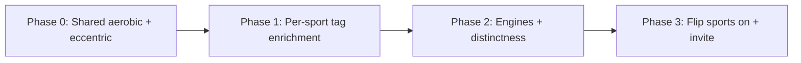

# Plan: Improve exercise mapping for 7 priority sports

**For:** Ellie · **Date:** 2026-08-12  
**Sports:** surfing · xc skiing · soccer · trail running · alpine skiing · backcountry skiing · snowboarding  
**Status:** ✅ Complete 2026-08-12 — pools clear; sports merged into `PILOT_SPORT_SLUGS` (19). Research: `docs/research/priority-sports-mapping-2026-08.md`.

Related: `docs/PILOT_SCOPE_PROPOSAL.md`, `lib/pilotCatalog.ts`

---

## How mapping actually works (read this once)

Generation does **not** rely on empty DB `sport_surfing`-style tags. It works like this:

1. User picks a sport + 1–N **sub-focuses** (e.g. alpine → `eccentric_control`).
2. Each `(sport, sub-focus)` maps to **quality tags** in `data/sportSubFocus/subFocusTagMap.ts` (e.g. `eccentric_strength`, `zone2_cardio`).
3. Exercises match when they carry those tags (catalog tags + `data/sportSubFocusEnrichment.ts` patches).
4. Scoring / intent slots / coverage then prefer matches. Some sports also have a deeper **engine** + pattern-transfer layer (`sportDefinitions.ts`, snow/trail/soccer transfer).

So “improve mapping” mostly means: **get the right core-pool exercises tagged for the right sub-focus keys** — and only add new exercises when tagging still leaves a real hole.

**Exit bar for a sport:** every sub-focus has **>12** direct matches in the Your Gym filtered pool (`npx tsx scripts/auditSubFocusPoolCoverage.ts`), and sport fidelity audit still green.

---

## Where each sport stands today

| Sport | Unique matches* | Critical / weak sub-focuses | Engine / transfer maturity |
|-------|----------------:|----------------------------|----------------------------|
| Surfing | ~119 | `balance` weak | Narrative only — no `engine` |
| XC skiing | ~133 | **`aerobic_base` critical** | No `engine`; snow-family transfer |
| Soccer | ~59 | **`aerobic_base` critical**, **`hamstring_resilience` critical** | Strong (field transfer + fidelity) |
| Trail running | ~44 | **`aerobic_base` critical** | Strong (`engine` + trail transfer) |
| Alpine skiing | ~45 | **`eccentric_control` critical**, `leg_strength` weak | Strong (`engine` + alpine transfer) |
| Backcountry | ~27 | `uphill_endurance` / `leg_strength` weak | Has `engine`; thinnest unique set |
| Snowboarding | ~37 | `leg_strength` / `balance` weak | **No `sportDefinitions` entry** |

\*Your Gym, post–1000-core trim. Shared crisis: **`aerobic_base` is nearly empty for everyone** because Zone-2 staples were demoted out of core or lack the exact tags.

---

## Plan overview (3 phases)



Work **Phase 0 first** (unblocks 3 sports at once), then sport-by-sport in priority order below.

---

## Phase 0 — Shared foundation (do first, ~1–2 days)

**Goal:** Fix the shared `aerobic_base` cliff and confirm we can promote without re-bloating core past ~1000–1100.

| # | Task | Detail |
|---|------|--------|
| 0.1 | **Inventory Zone-2 / incline / ski-erg / rower staples** now in `eligible_phase2` or niche that should match `aerobic_base` / `zone2_cardio` / `uphill_endurance` | Script: list by slug + eligibility + tags |
| 0.2 | **Promote a small set (~20–40) back to `eligible_core`** | Only true staples (treadmill Z2, incline walk/run, ski erg, rower Z2, step-ups). Re-trim elsewhere if needed to stay near 1000 |
| 0.3 | **Tag those staples** with `aerobic_base`, `zone2_cardio` (and `uphill` / incline tags where relevant) via `sportSubFocusEnrichment.ts` + DB `exercise_tag_map` if needed | Same pattern as `docs/research/conditioning-intent-pool-expansion-2026-06.md` |
| 0.4 | **Re-run** `auditSubFocusPoolCoverage.ts` — xc / trail / soccer `aerobic_base` must leave critical | Gate |

**Done when:** `aerobic_base` ≥ 12 matches for trail, xc, and soccer on Your Gym.

---

## Phase 1 — Per-sport mapping (tag enrichment first)

Order by product urgency + how broken the matcher is:

### Wave A — Snow day quality (alpine → snowboard → backcountry)

| Sport | Priority holes | Mapping work | Optional later |
|-------|----------------|--------------|----------------|
| **Alpine** | `eccentric_control`, `leg_strength` | Tag RDLs, split squats, reverse lunges, step-downs, wall sits with `eccentric_strength` / `eccentric_quad_strength` / `single_leg_strength` **as listed in alpine’s tag map**. Promote a few eccentric staples if still phase2. | Already has engine — don’t rebuild |
| **Snowboarding** | `leg_strength`, `balance` | Same leg tags as alpine **plus** `balance` / `single_leg` / lateral tags on skater / Cossack / single-leg work. **Add `sportDefinitions` entry** (copy structure from alpine, snowboard-specific cues). | Lateral COD drills only if still weak |
| **Backcountry** | `uphill_endurance`, `leg_strength` | Reuse Phase 0 uphill/Z2 tags; tag step mill / weighted step-ups / pack-carry patterns for uphill; share alpine leg tags | Distinctness vs alpine (don’t make sessions identical) |

**Gate:** alpine `eccentric_control` > 12; snowboard + backcountry no critical; unique counts trending up.

### Wave B — Endurance + field (trail → xc → soccer)

| Sport | Priority holes | Mapping work | Optional later |
|-------|----------------|--------------|----------------|
| **Trail** | Mostly fixed by Phase 0; check `downhill_control`, `ankle_stability` | Enrich eccentric downhill + ankle CARs / calf / single-leg if still thin | Already strong engine |
| **XC** | After Phase 0, check `double_pole_upper`, `leg_drive` | Tag pull/ski-erg / double-pole analogs; add light **`engine`** in `sportDefinitions` (can start as thin copy of endurance ski) | Nordic-specific pieces later |
| **Soccer** | `hamstring_resilience` | Tag Nordic curls, RDLs, sliding leg curls, hamstring iso with exact map tags (`hamstrings`, `eccentric_strength`, etc.). Speed/COD already OK. | Keep field transfer; avoid turning every day into pure gym legs |

**Gate:** soccer `hamstring_resilience` > 12; xc no critical.

### Wave C — Surfing polish

| Sport | Priority holes | Mapping work | Optional later |
|-------|----------------|--------------|----------------|
| **Surfing** | `balance` | Tag balance / pop-up / rotational / shoulder-endurance staples; add **`engine`** (paddle + pop-up + rotation biases) | New surf-specific moves only if still thin |

**Gate:** surfing `balance` > 12; sub-focus coverage audit clean.

---

## Phase 2 — Make sports feel distinct (after pools are healthy)

Only after Phase 0–1 gates pass — otherwise you’re polishing empty shelves.

| # | Task |
|---|------|
| 2.1 | Snow family distinctness: alpine vs snowboard vs backcountry sessions shouldn’t look interchangeable (`auditSportPatternDistinctness` / manual review) |
| 2.2 | Surfing + XC `engine` profiles in `sportDefinitions.ts` (qualities, default body bias, coaching lines) |
| 2.3 | Starter-exercise names for ranking bias (secondary — does not fix matcher counts) |
| 2.4 | Flip `is_active` + add to `PILOT_SPORT_SLUGS` when a sport clears gates |

**Do not** invest in DB `sport_*` tags or `curation_sport_transfer_tags` as the main path — they aren’t wired into matching today.

---

## Phase 3 — Turn on + invite

For each sport that clears gates:

1. Add slug to `PILOT_SPORT_SLUGS` in `lib/pilotCatalog.ts`
2. `UPDATE sports SET is_active = true WHERE slug = …`
3. Re-run `auditSportSubGoalGenerationFidelity` + one persona sim for that sport
4. Invite 1–2 testers who actually do that sport

Suggested invite order once ready: **trail / alpine → soccer → surfing → snowboard / backcountry / xc**.

---

## What we will *not* do in this plan

- Hand-picking hundreds of new exotic exercises first  
- Growing core back to 2000+  
- Relying on empty `sport_*` DB tags  
- Shipping these 7 to skiers/surfers/soccer athletes while `aerobic_base` / `eccentric_control` are still critical  

---

## Validation checklist (every wave)

```bash
npx tsx scripts/auditSubFocusPoolCoverage.ts          # primary pool gate
npx tsx scripts/auditSportSubGoalGenerationFidelity.ts
npx tsx scripts/auditExerciseTagMatchability.ts       # optional
# targeted: alpineSkiingGeneration / surfing / soccer coverage tests
```

Accept: no **critical** (≤5) on the 7 sports’ sub-focuses; weak (≤12) only with a written reason.

---

## Suggested calendar

| Window | Focus |
|--------|--------|
| Days 1–2 | Phase 0 (aerobic + promotions) |
| Days 3–5 | Wave A snow (alpine → snowboard → backcountry) |
| Days 6–8 | Wave B trail / xc / soccer |
| Days 9–10 | Wave C surfing + Phase 2 engines |
| Rolling | Flip on + invite as each sport clears |

---

## Decision for Ellie

1. **Approve this order?** Phase 0 → snow → endurance/field → surfing  
2. **Core budget:** OK to grow core slightly (e.g. to ~1050–1100) for Zone-2/eccentric staples, or strictly re-trim 1:1 when promoting?  
3. **First sport to flip on after gates:** trail, alpine, or soccer?
